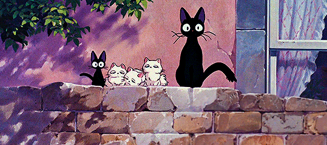

<!-- Header -->

  

---
<!-- Banner / Header -->
<h1 align="center" style="color:red;">❤️ Hey, I'm Deepika Elsa ❤️</h1>

## 👤 About Me

  

- 💻 Began the journey with **Data Science, Machine Learning And Generative AI**  
- 🎨 Worked on **Front-end Development & Web Designing**  
- 📊 Currently pursuing a **degree in Computer Science**  
- 🌐 Focused on **Data Science & AI/ML**  
- 🤖 Interested in **AI, Machine Learning, Deep Learning, Data Science**  
- 🎯 Motto: *I only like perfection.*  

---

## 🛠️ Languages & Tools I Have Worked With

  

---

## 📊 GitHub Stats

  
  
  

---

## 🚀 Tech Stack

- **Languages**: C, C++, Java, Python, C#  
- **Frameworks**: React, Angular, Flask, Django  
- **Databases**: SQL Server, MySQL, MongoDB  
- **Tools**: Git, GitHub, Docker, Linux, VS Code, LM Studio, lama  
- **Cloud**: AWS, Azure  

---

## 🌟 Top Contributed Repositories

- 🔥 [Sentiment Analysis](https://github.com/DeepikaElsa/sentiment-analysis)  
- 📄 [StudySync](https://github.com/DeepikaElsa/studysync)  
- 🖼️ [Student Team Management](https://github.com/DeepikaElsa/StudentTeamManagement)  

---

## 📜 Random Dev Quote

> *"Sometimes, the elegant implementation is a function. Not a method. Not a class. Not a framework. Just a function."*  
— John Carmack  

---

## ☕ Support Me

  

---

💡 Connect with me on  
<a href="mailto:deepikajoseph50@gmail.com">📧 Email</a> | 
<a href="https://www.linkedin.com/in/deepika-elsa-joseph-38044228a">💼 LinkedIn</a> | 
<a href="https://in.pinterest.com/deepikaelsajoseph/">🎍 Pinterest</a>

---

<!-- Footer -->

  

